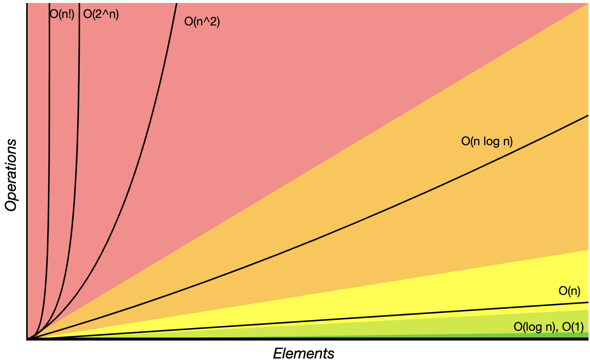

# 如何来判断程序的复杂度

所有的复杂度最难判断的其实是 log n 的判断
O(log(n)): 需要查全体数据，但是每次都能把剩下的数据拆成两（若干）小堆并且只查其中一堆
O(log(n))：算法复杂度和问题规模是对数关系。换句话说，数据量大幅增加时，消耗时间/空间只有少量增加（比如，当数据量从2增加到2^64时，消耗时间/空间只增加64倍）

常见的 nlog(n) 的例子比如使用分治法来解决的问题，如归并排序
> 假如有 32 份试卷，你丢一次，还剩 16份，丢两次，还剩下8份，丢三次，就只剩下 4 份，可以这么一直丢下去，丢到第五次，就只剩下一份
> 而 log<sub>2</sub>(32) = 5。也就是我们一次丢一半，总要丢到只有一份的时候才能出结果，如果有 n 份，那么显然我们就有：
> n / 2<sup>k</sup> = 1 -> k = log<sub>2</sub>n
> 也就是大约需要 log<sub>2</sub>n 次，才能得到"找到"或者"没找到"的结果。当然你说你三分查找，每次丢三分之二可不可以？当然也可以
> 但是算法复杂度在这里说忽略常数的，所以不管是以2为底，还是以什么数字为底，都统一的写成 log(n) 的形式

下面这个的复杂度是 O(log(n));
```javascript
for (let i = 1; i < n; i = i * 2) {
  console.log(i);
}
```

下面这个复杂度是 O(k^n)，也就是指数级，这里的 k 是个常数，可以是2或者3或者是啥的
```javascript
const fib = function (n) {
  if (n <= 2) {
    return n;
  }
  
  return fib(n - 1) + fib(n - 2);
}
```
 
对于整个归并排序，总时间复杂度为分割+合并，即 O(n + nlogn)，忽略低阶项，就是 O(nlogn)

时间复杂度的一些图表

通过查看下图，知道我们在做日常优化的时候，会将阶乘(o(n!))的 的复杂度尽量降为指数(O(2^n))的复杂度，以此类推


抽象数据结构的操作复杂度


数组排序


图操作


堆操作


> 以上数据图表来自 [1](https://liam.page/2016/06/20/big-O-cheat-sheet/) | [2](https://www.bigocheatsheet.com/)

## 复杂度概念
Big O notation

- O(1): Constant Complexity 常数复杂度
- O(log n): Logarithmic Complexity 对数复杂度
- O(n): Liner Complexity 线性时间复杂度
- O(N^2): N square Complexity 平方
- O(n^3): N square Complexity 立方
- O(2^n): Exponential Growth 指数
- O(n!): Factorial 阶乘

> 复杂度都是只看最高复杂度的运行 
> 
> 算法导论给出的解释：大O用来表示上界的，当同它作为算法的最坏情况运行时间的上界，就是对任意数据输入的运行时间的上界


[stackoverflow - what-is-a-plain-english-explanation-of-big-o-notation](https://stackoverflow.com/questions/487258/what-is-a-plain-english-explanation-of-big-o-notation)