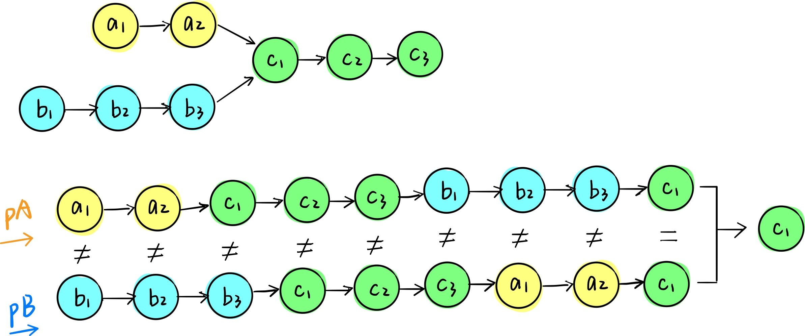

# 106 相交链表

[原题地址-参考](https://leetcode-cn.com/problems/intersection-of-two-linked-lists/solution/javascriptxiang-jiao-lian-biao-tu-jie-shuang-zhi-z/)


解法一
> 先遍历 headA 并打上标记，再遍历 headB 寻找标记
> 这个方法也是最好理解的

我看到这个解法的时候，真的觉得刷题真的太有意思了，脑洞真是太大了，这群聪明人真是太会玩了
```js
const getIntersectionNode = function(headA, headB) {
    while (headA) {
        headA.sep = 1;
        headA = headA.next;
    }
    while (headB) {
        if (headB.sep) return headB;
        headB = headB.next;
    }
};
```

解法二
> 双指针法。初始化两个指针pA和pB分别指向headA和headB，每次pA和pB各走一步，当pA触底后变轨到headB，同理，当pB触底后变轨到headA。这样就只需遍历（A的非公共部分+B的非公共部分+AB的公共部分）。
> 
> 老实说这种解法感觉效率得靠运气
```js
const getIntersectionNode = function(headA, headB) {
    let pA = headA;
    let pB = headB;
    while (pA !== pB) {
        // 当前列表走完后，就从头开始走对方的列表，这样总会有个相交的点
        // 为什么他们就一定会有 pA === pB 的时候呢，而且这样不是要多次循环 headA 和 headB，效率是不是得靠运气
        pB = pB ? pB.next : headA;
        pA = pA ? pA.next : headB;
    }

    return pA;
}
```
