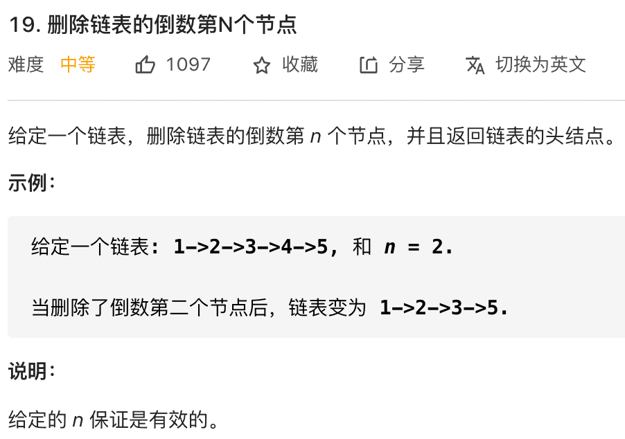

# 19. 删除链表的倒数第N个节点

题目



使用快慢指针，让快指针先走 n 步，然后快慢指针开始同速前进。这样当快指针走到链表末尾 null 时，慢指针所在的位置就是倒数第 n 个链表节点（n 不会超过链表长度）

这个思路真好
也就是第一个先走 n 步，然后第二个和第一个一起走，判断第一个的next不要是null，如果是 null，说明这个链就走完了
这时候第二个的位置就是倒数的 n 了
原理其实就是第一个先走 n 步，这时候第一个和第二个再走 (len - n)，第一个就到底了，但是第二个就到了 (len - n) 的位置了

```javascript
ListNode removeNthFromEnd(ListNode head, int n) {
    ListNode fast, slow;
    fast = slow = head;
    // 快指针先前进 n 步
    while (n-- > 0) {
        fast = fast.next;
    }
    if (fast == null) {
        // 如果此时快指针走到头了，
        // 说明倒数第 n 个节点就是第一个节点
        return head.next;
    }
    // 让慢指针和快指针同步向前
    while (fast != null && fast.next != null) {
        fast = fast.next;
        slow = slow.next;
    }
    // slow.next 就是倒数第 n 个节点，删除它
    slow.next = slow.next.next;
    return head;
}
```