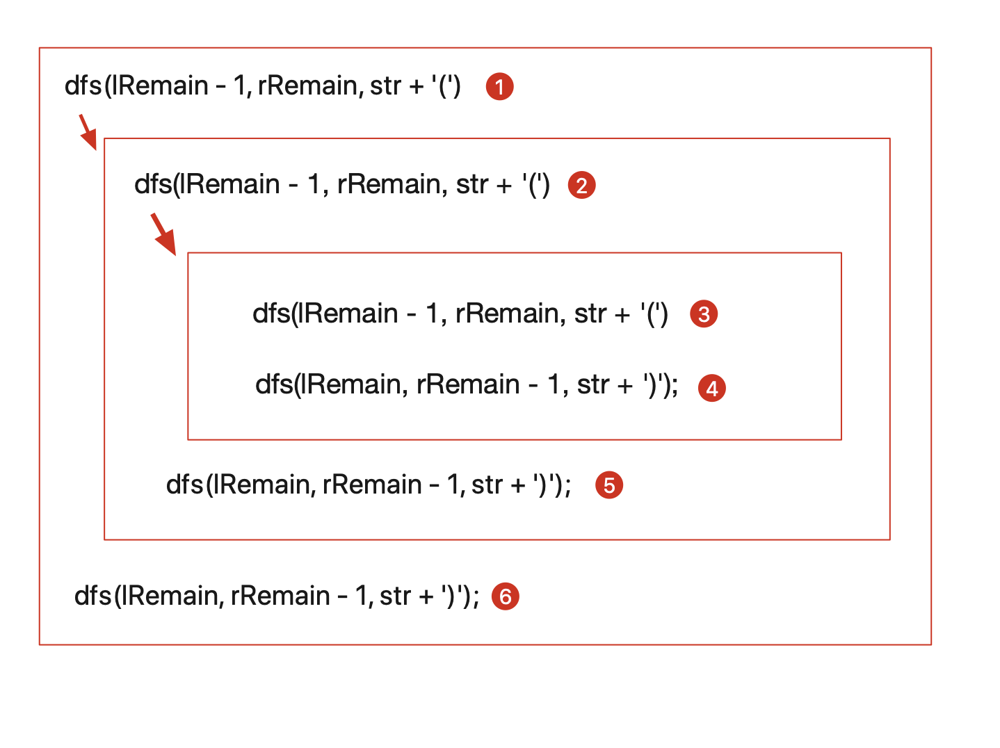
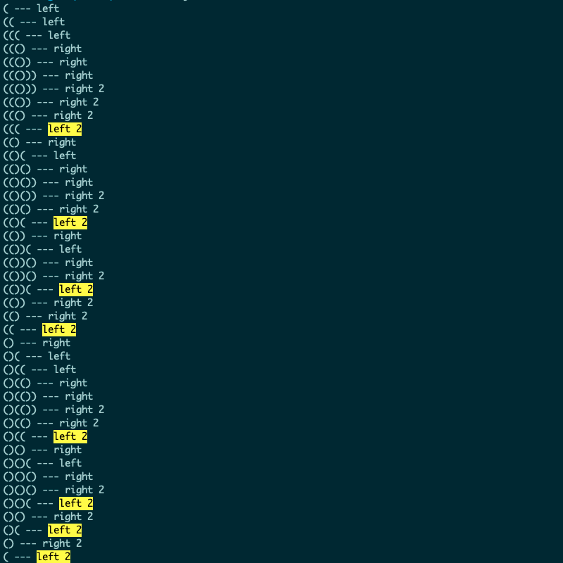

# 22-括号生成

原题(https://leetcode-cn.com/problems/generate-parentheses/)

数字 n 代表生成括号的对数，请你设计一个函数，用于能够生成所有可能的并且 有效的 括号组合。

> 示例 1：
>
> 输入：n = 3
> 输出：["((()))","(()())","(())()","()(())","()()()"]
> 示例 2：
>
> 输入：n = 1
> 输出：["()"]

解法：使用回溯法
> 这种解法和二叉树的前中后序遍历的解法是一样的，所以还是得先去搞懂二叉树的遍历啊

老实说，我觉得下面这种方法真的是非常的中规中矩，但我就是没有理解这里面的这两个 if 条件，为什么第二个 if 条件是 lRemain < rRemain
```javascript
const generateParenthesis = function (n) {
  const res = [];

  const dfs = (lRemain, rRemain, str) => {
    if (str.length === 2 * n) {
      res.push(str);
      return;
    }

    // 既然需要把 ( 的次数遍历完，那么不是就只有一种情况，就是 ((())) 这种？为什么这种 dfs 还能产生其他的结果
    // 上面的这个问题想明白了，为什么会有上面这种想法，就是我们日常在写递归的时候，总是在一个函数里执行完所有的操作，然后返回，如 fibonacci 这种
    // 但是这里在 if (lRemain > 0) 分支里执行完 dfs 后，下面是还需要执行 if (lRemain < rRemain) 的分支的
    // 只不过是在 执行完 if (lRemain > 0) 里的dfs，然后再执行下面的 if (lRemain < rRemain) 的 dfs 
    // 也就是再  if (lRemain > 0) 种的 dfs，如果不是到 终止条件 if (str.length === 2 * n)，那么这个 if (lRemain > 0) 中 dfs  下面中if (lRemain < rRemain) 中的dfs

    // 回溯法把这里的条件称为剪枝，就是把不符合条件的去掉（下同）
    if (lRemain > 0) {
      dfs(lRemain - 1, rRemain, str + '(');
    }

    if (lRemain < rRemain) {
      dfs(lRemain, rRemain - 1, str + ')');
    }
  }

  dfs(n, n, '');

  return res;
}

let result = generateParenthesis(3);
console.log(result);
```

也就是在如下的 dfs 中会重新进行包含一次子层中的 if (lRemain > 0) 和 if (lRemain < rRemain) 中的 DFS
```javascript
if (lRemain > 0) {
  dfs(lRemain - 1, rRemain, str + '(');
}
```
如下所示


调试一些，增加一些打印，然后看打印的结果是什么
```javascript
if (lRemain > 0) {
  console.log(str + '(', '--- left')
  dfs(lRemain - 1, rRemain, str + '(');
  console.log(str + '(', '--- left 2')
}

if (lRemain < rRemain) {
  console.log(str + ')', '--- right')
  dfs(lRemain, rRemain - 1, str + ')');
  console.log(str + ')', '--- right 2')
}
```

打印结果如下，可以看到在第一次生成了 '((()))' 的结果后，开始往前回溯
这里面往前回溯，其实就是在执行完成了 if (lRemain > 0) 中的 dfs 后，开始往下执行 if (lRemain < rRemain) 中的dfs
