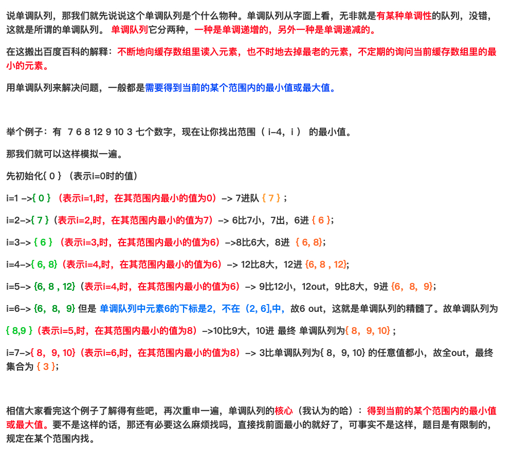

# 239-滑动窗口最大值

[原题](https://leetcode-cn.com/problems/sliding-window-maximum/)
> 还是得把题目复制过来

这里涉及到使用到[单调队列](https://blog.csdn.net/ljd201724114126/article/details/80663855)
```javascript
const maxSlidingWindow = function (nums, k) {
    // 存放单调队列的下标
    const deque = [];
    const result = [];
    for (let i = 0; i < nums.length; i++) {
        // 在滑动窗口之外的直接从队头删掉
        if (i - deque[0] >= k) {
            deque.shift();
        }

        // 如果新加进来的数比单调队列中原来的数都要大，则直接弹出队列中的其他数
        while (nums[deque[deque.length - 1]] <= nums[i]) {
            deque.pop();
        }

        // 这是个要点：也就是在单调队列这个概念中，当前的 i 是一定会添加到单调队列中的
        deque.push(i);

        // 数组下标从0开始，k=3时 ，下标为0，1，2的数组元素构成一个滑动窗口，所以条件为i>=k-1就可以将答案存入res中
        if (i >= k - 1) {
            result.push(nums[deque[0]]);
        }
    }

    return result;
}

let nums = [1,3,-1,-3,5,3,6,7], k = 3;
let res = maxSlidingWindow(nums, k);
console.log(res);
```


