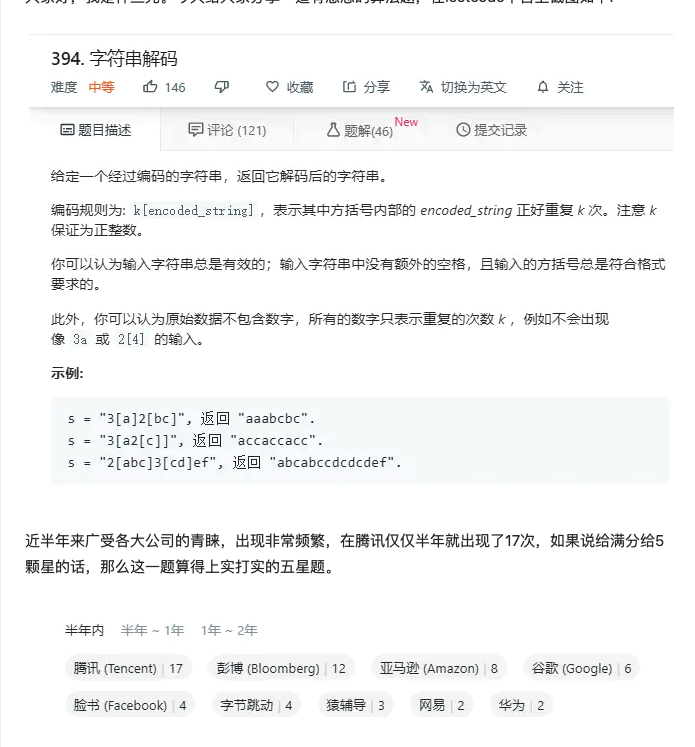

# 394-字符串解码.md
**难度：中等**

[原题](https://juejin.im/post/5dc2a7cce51d4504f0726a00)
> 因为会员才能看到，所以截了个图


这道题一上来就感觉要用正则来匹配，看到文章中写的使用栈，递归啥的，感觉都挺麻烦的
```js
const decodeString = function (s) {
    return s.replace(/(\d+)\[(\w+)\]/g, (a, b, c) => {
        // 匹配的 a 就是 3[a] 这种，b 就是第一个括号(\d+)匹配到的数字，c 就是第二个括号(\w+)匹配到的字符串，也就是 a b c 都是按照层级顺序这样往后排的
        return c.repeat(b);
    });
}
```

面试官肯定不会就这么容易让你过的，
比如不适用正则呢
比如不使用 `String` 的 `repeat` 方法呢
其实还是要揣摩面试官考察你的意图，如果是想考察栈这种数据结构，或者是想考察递归和回溯思想的理解呢？

