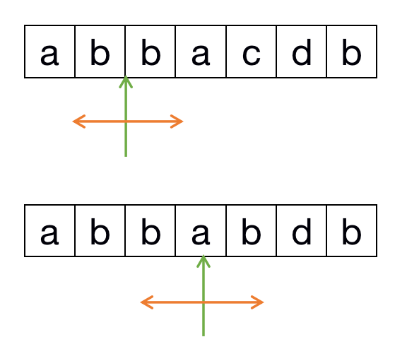

# 5-最长回文字符串

[原题](https://leetcode-cn.com/problems/longest-palindromic-substring/)

> 第516-最长回文子序列是计算最长回文的长度，这里是将回文返回


首先来一个最好理解的，
时间复杂度是 O(n^3)
空间复杂度是 O(1)
```javascript
const longestPalindrome = function (s) {
    let ans = '';
    let max = 0;
    let len = s.length;
    for (let i = 0; i < len; i++) {
        for (let j = i + 1; j < len; j++) {
            let tempStr = s.substring(i, j);
            // 每次判断当前是否是回文字符串，然后判断长度是否大于 max
            if (isPalindrome(tempStr) && tempStr.length > max) {
                ans = s.substring(i, j);
                max = tempStr.length;
            }
        }
    }

    return ans;
}

function isPalindrome(str) {
    let len = str.length;
    let middle = parseInt(len / 2);
    // 不管是奇数还是偶数，都可以通过这种方式
    // 奇数 caac 比较的是 0->3 1->2
    // 偶数 cac 比较的是 0->2 中间的 1 是不用比较的
    for (let i = 0; i < middle; i++) {
        // 这个是比较回文字符串比好好的方式
        if (str[i] !== str[len - i - 1]) {
            return false;
        }
    }

    return true;
}

let result = longestPalindrome('abbcaacz');
console.log(result);
```

第二种方式是使用动态规划的方式
时间复杂度 O(n^2)
空间复杂度 O(n) -> 二位数组的空间复杂度应该也是 O(n) 吧？
```javascript
const longestPalindrome = function (s) {
    let n = s.length;
    let res = '';
    let dp = Array.from(new Array(n), () => new Array(n).fill(0));

    // 这个解法感觉不太好记啊
    // 咋不好记啊，dp[i][j]的判定条件是当前两个字符串相同，并且之前的也相同，然后就计算相同的长度，就两步而且联系还这么紧密
    for (let i = n - 1; i >= 0; i--) {
        for (let j = i + 1; j < n; j++) {
            // 设置当前 dp[i][j] 是否是回文字符串
            dp[i][j] = (
                // s[i] === s[j] 说明当前是字符串
                s[i] === s[j]
                // j - i < 2 是 j = i + 1 的情况，这时候因为 dp[i + 1][j - 1] 是 undefined，没有值，
                // 所以这时候如果 s[i] === s[j] 就直接返回 true 就可以
                // dp[i + 1][j - 1] 说明之前也是一个回文字符串
                && (j - i < 2 || dp[i + 1][j - 1])
            );

            // 如果当前是一个回文字符串，并且长度比之前计算的回文字符串长，那么就继续更新最长回文字符串的长度
            if (dp[i][j] && (j - i + 1 > res.length)) {
                res = s.substring(i, j + 1);
            }
        }
    }

    return res;
}

let result = longestPalindrome('abbcaac');
console.log(result);
```

中心拓展法
> 这个应该好理解一点

思路

- 回文串一定是对称的
    - 每次选择一个中心，进行中心向两边扩展比较左右字符是否相等
    - 中心点的选取有两种
        - aba，中心点是b
        - aa，中心点是两个a之间
    - 所以共有两种组合可能
        - left：i，right：i
        -  left：i，right：i+1
    - 图解
      - 


```javascript
const longestPalindrome = function (s) {
    let start = 0, end = 0;
    let n = s.length;

    for (let i = 0; i < n; i++) {
        // 中心点的选取有两种可能，一种是中间位置如 aba 就从 b 开始
        let len1 = centerExpend(i, i);
        // 另一种是 abba 就是从中间的 bb 开始
        let len2 = centerExpend(i, i + 1);
        // 比较上面两种的长度
        let maxLen = Math.max(len1, len2);
        // 这一块其实会不太好理解
        if (maxLen > end - start) {
            // 因为是从 i 往两边扩散，所以计算开始位置，就是 中间的位置 减去 长度的一半
            // 那为什么开始的这里，需要使用 maxLen - 1 而结束那里不用
            start = i - Math.floor((maxLen - 1) / 2);
            // 结束的位置，那就是 中间的位置 加上 长度的一半
            end = i + Math.floor(maxLen / 2);
        }
    }

    // 这个还是比较好理解的，就是从中间开始，往两边扩散，如果两边的相同，就继续往两边扩散
    let centerExpend = (left, right) => {
        while (left >= 0 && right < n && s[left] === s[right]) {
            left--;
            right++;
        }
        return right - left - 1;
    }

    return s.substring(start, end + 1);
}

let result = longestPalindrome('abbca');
console.log(result);
```

下面这个中心扩散法更好记，也更好理解
```javascript
const longestPalindrome = function (s) {
    let res = '';
    for (let i = 0; i < s.length; i++) {
      /*
      * 有两个，可能是不确定 s 的长度是奇数还是偶数，所以都计算一下 
      * ans 应该不是，而是这个回文是当前为中心，还是前后为中心 比如，是 aba 或者是 abba 这两种形式
      * */
        centerExpand(i, i);
        centerExpand(i, i + 1);
    }
    
    function centerExpand(left, right) {
        while (left >= 0 && right < s.length && s[left] === s[right]) {
            left--;
            right++;
        }
        
        // 注意此处left, right 的值循环后，是恰好不满足循环条件的时刻
        // 此时left 到 right 的距离是 right - left + 1，但是 left, right 两个边界是不能取，
        // 所以应该取 left + 1 和 right - 1的区间，长度是 right - left - 1
        if (right - left - 1 > res.length) {
            // substring 也要取 [left + 1, right - 1] 的区间，因为 substring(from, to) 中的 to 这一位不会取，
            // 所以这里就不让 rihgt - 1 了
            res = s.substring(left + 1, right);
        }
    }
}
```
