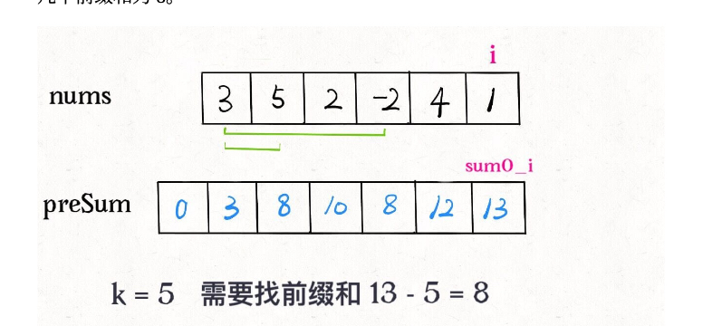

# 560-和为K的子数组

[原题](https://leetcode-cn.com/problems/subarray-sum-equals-k/)

这里提到了一种[前缀和](https://labuladong.gitee.io/algo/%E7%AE%97%E6%B3%95%E6%80%9D%E7%BB%B4%E7%B3%BB%E5%88%97/%E5%89%8D%E7%BC%80%E5%92%8C%E6%8A%80%E5%B7%A7/)的概念
[题解参考](https://leetcode-cn.com/problems/subarray-sum-equals-k/solution/dai-ni-da-tong-qian-zhui-he-cong-zui-ben-fang-fa-y/)
```javascript
const subarraySum = function (nums, k) {
    let n = nums.length;
    let sum = Array.from({length: n + 1}, () => 0);
    for (let i = 0; i < n; i++) {
        sum[i + 1] = sum[i] + nums[i];
    }

    let ans = 0;
    for (let i = 0; i <= n; i++) {
        for (let j = 0; j < i; j++) {
            if (sum[i] - sum[j] === k) {
                ans++;
            }
        }
    }

    return ans;
}

let nums = [1,1,1], k = 2
let result = subarraySum(nums, k);
console.log(result)
```

优化
```javascript
const subarraySum = function (nums, k) {
    let n = nums.length;
    let preSum = new Map();
    // 主要还是没明白，这里为什么要设置初始值为0的次数有1次
    // 明白了：看下面的解释
    preSum.set(0, 1);
    let res = 0, curr_sum = 0;
    
    for (let i = 0; i < n; i++) {
        curr_sum += nums[i];
        
        if (preSum.has(curr_sum - k)) {
            res += preSum.get(curr_sum - k);
        }
        preSum.set(curr_sum, (preSum.get(curr_sum) || 0) + 1);
    }

    console.log(preSum)

    return res;
}

let nums = [1,1,1], k = 2
// let nums = [3, 5, 2, -2, 4, 1], k = 5
let result = subarraySum(nums, k);
console.log(result)
```

上面有一个重点，就是preSum.set(0, 1)，设置了为和为0的时候有一次
这个是为了来为了满足当for循环的时候，i为零的时候，如下图
也就是在 i = 0 的时候，sum += nums[0] 的，这时候 sum 的初始值是0，所以这里设置了一些 和为零的时候的次数是1 
