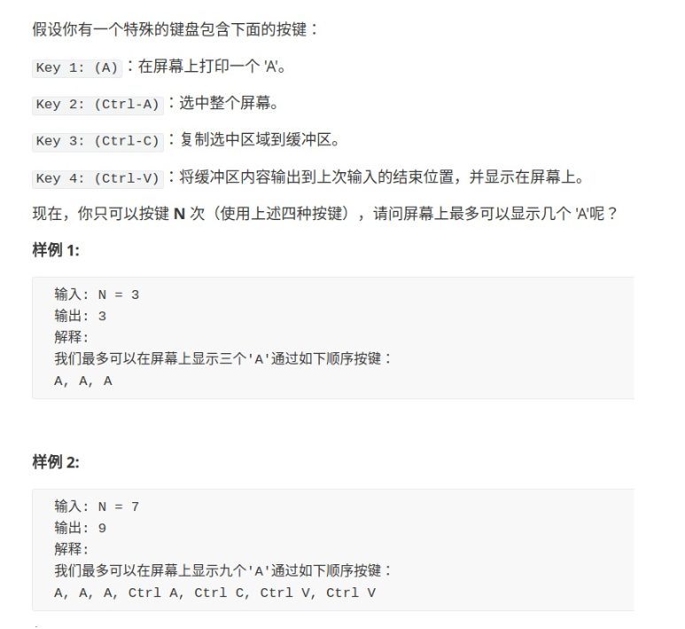

# 651-四键键盘

会员才能查看题目 


> 这种题目真的太牛逼了，太有意思了


[题解参考- labuladong的算法小抄 - 经典动态规划：四键键盘](https://labuladong.gitbook.io/algo/di-er-zhang-shou-ba-shou-shua-dong-tai-gui-hua/yong-dong-tai-gui-hua-wan-you-xi/dong-tai-gui-hua-zhi-si-jian-jian-pan)

首先第一种解法的思路是，三种操作都执行，然后找到结果最大的那一个
感觉这种方法能想到也真是太牛逼了，通过改变 dp 中的后两个的参数，来达到复制粘贴的计算
```javascript
const maxA = function (N) {
    const dp = function (n, a_num, copy) {
        if (n <= 0) {
            return a_num;
        }
        
        return Math.max(
            // 第一个参数是执行了当前的操作后，还剩下的步骤数
            dp(n - 1, a_num + 1, copy), // 按A
            dp(n - 1, a_num + copy, copy), // 按 ctrl + v
            dp(n - 2, a_num, a_num) // 按 ctrl + a 以及 ctrl + c ，因为这两个操作是需要同时操作的
        )
    }
    
    return dp(N, 0, 0);
}
```

第二种解法，就需要首先思考出，如何按键才能得到最多次数的 A 了
```javascript
const maxA = function (N) {
    const dp = Array.from({length: N + 1});
    dp[0] = 0;

    for (let i = 1; i <= N; i++) {
        // 按 A 键
        dp[i] = dp[i - 1] + 1;
        for (let j = 2; j < i; j++) {
            // 全选 & 复制 dp[j - 1], 连续粘贴 i - j 次
            // 屏幕上共 dp[j - 2] * (i - j + 1) 个 A
            dp[i] = Math.max(dp[i], dp[j - 2] * (i - j + 1));
        }
    }

    return dp[N];
}

let result = maxA(7);
console.log(result);
```

这种思路稍微有点复杂，但是效率高。继续走流程，「选择」还是那 4 个， 但是这次我们只定义一个「状态」，也就是剩余的敲击次数 n 。

这个算法基于这样一个事实，**最优按键序列一定只有两种情况**:

- 要么一直按 A :A,A,...A(当N比较小时)。
- 要么是这么一个形式:A,A,...C-A,C-C,C-V,C-V,...C-V(当 N 比较大时)。

因为字符数量少(N 比较小)时， C-A C-C C-V 这一套操作的代价相对比较 高，可能不如一个个按 A ;而当 N 比较大时，后期 C-V 的收获肯定很 大。
这种情况下整个操作序列大致是: **开头连按几个** **A** **，然后** **C-A C-C** **组合再接若干** **C-V** **，然后再** **C-A C-C** **接着若干** **C-V** **，循环下去**。