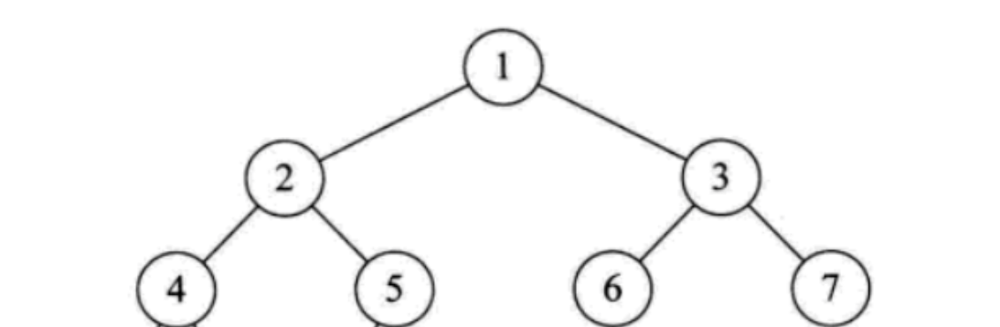

# 94-二叉树的中序遍历

[原题](https://leetcode-cn.com/problems/binary-tree-inorder-traversal/solution/dan-ke-xi-lie-yong-shi-9035nei-cun-10000-by-lvshan/)
 
## 解法
首先是使用最常见的的递归的方式来解决
```js
const inorderTraversal = function (root) {
    const res = [];
    const inorder = (root) => {
        if (!root) {
            return;
        }
        inorder(root.left);
        res.push(root.val);
        inorder(root.right);
    }

    inorder(root);
    return res;
}
```

主要还是之前一直没有明白为什么二叉树的前中后遍历是更换以下三行的顺序就可以的
- 前序（头左右）
```javascript
res.push(root.val);
preorder(root.left);
preorder(root.right);
```

- 中序（左头右）
```javascript
inorder(root.left);
res.push(root.val);
inorder(root.right);
```

- 后序（左右头）
```javascript
postorder(root.left);
postorder(root.right);
res.push(root.val);
```


首先看一下二叉树的结构


前序遍历：头左右 -> 1 2 4 5 3 6 7 \
中序遍历：左头右 -> 4 2 5 1 6 3 7 \
后续遍历：左右头 -> 4 5 2 6 7 3 1 

理清前序遍历的顺序（头左右）
```javascript
const preOrderTraversal = function (root) {
    let res = [];
    const preOrder = (root) => {
        if (root === null) {
            return;    
        }
        // 首先把头部节点添加进去
        res.push(root.val);
        // 然后这时候进入遍历节点的左节点
        // 不断调用 res.push 把左节点添加进去
        preorder(root.left);
        // 知道没有左节点了，触发了 if (root === null) 的判定规则，返回
        // 然后开始遍历右节点
        preorder(root.right);
    };
    
    preOrder(root);
    return res;
}
```

理清中序遍历的顺序（左头右）
```javascript
const inorderTraversal = function (root) {
    let res = [];
    const inorder = (root) => {
        if (root === null) {
            return;    
        }
        // 首先开始一直遍历左节点，如果一直有左节点，那么就一直遍历到最后的左节点
        inorder(root.left);
        // 将左节点添加进去
        res.push(root.val);
        // 最底端的左节点添加进去之后，就会执行下面这条语句，这时候就会将与最左边同父级的右节点开始 inorder
        // 然后看这个右节点是否有左节点inorder(root.left); 此时这里的root就是前一次的 root.right 传进来的
        inorder(root.right);
    };
    
    inorder(root);
    return res;
}
```

理清后续遍历的顺序（左右头）
```javascript
const postorderTraversal = function (root) {
    const postorder = root => {
        if (root === null) {
            return;
        }   
        // 同上，既然前序和中序理解了，那么后续肯定也能理解为什么了
        postorder(root.left);
        postorder(root.right);
        res.push(root.val);
    }    
    
    postorder(root);
    return res;
}
```
