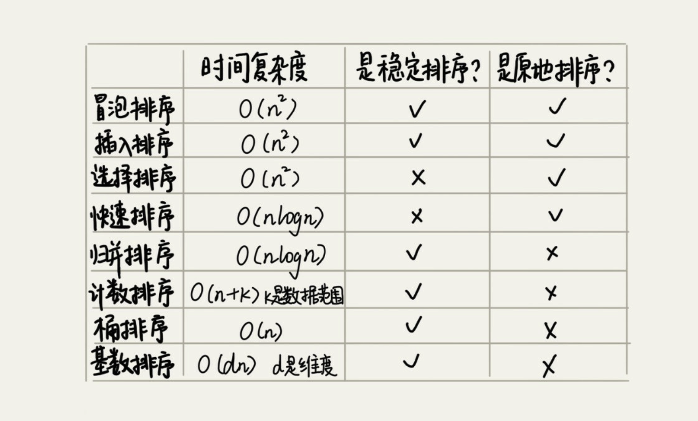

- [插入排序](./insert.md)
- [归并排序](./merge.md)
- [希尔排序](./shell.md)
- [快速排序](./quick.md)

冒泡排序、插入排序、选择排序这三种排序算法，它们的时间复杂度都是 O(n)，比
较高，适合小规模数据的排序。
时间复杂度为 O(nlog(n)) 的排序算法，归并排序和快速排序。
这两种排序算法适合大规模的数据排序，比上三种排序算法要更常用。
> 看到覃超在极客时间中的《算法面试通关40讲》中的第11讲 返回数据流中的第K大元素 中提了一句，说排序最佳的方式就是快排

排序的复杂度

